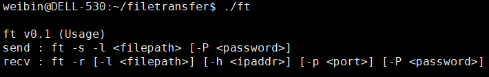
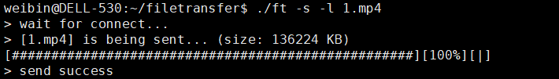
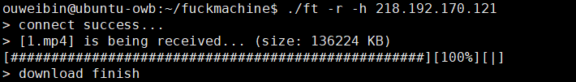

# File-Transfer

简单的用于文件传输的命令行工具

## 特点

- 服务端阻塞发送，客户端阻塞接收

  在阻塞模式下send()会等待所有数据均被拷贝到发送缓冲区后才返回

  在阻塞模式下recv()会一直阻塞到接收缓冲区里有一个字节或一个字节以上为止，然后再返回

  Linux内核提供了动态调整缓冲区大小的功能

- 使用简单的加密方法，根据srand(password)产生的随机数作为秘钥
- 进度条实时显示文件传输进度
- 使用百兆网卡进行测试，实时速率达到11.7MB/s

## 限制

- 传输文件大小不超过2GB
- password只能包含数字且在[0, 2147483648‬]区间

## 操作

